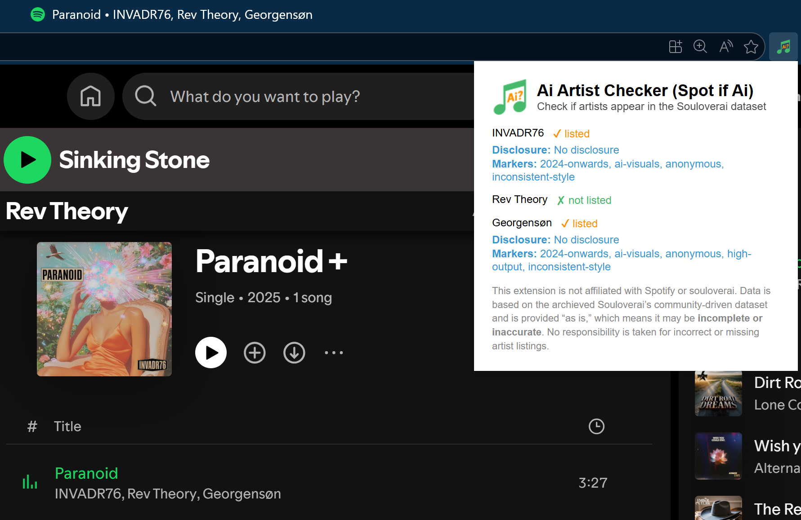

#  Ai-Artist-Checker (Spot-if-Ai)
This browser extension helps you quickly check whether the artist you’re currently listening to on Spotify Web Player is listed as using AI. 

Currently only [Chrome](https://chromewebstore.google.com/detail/ai-artist-checker/djbdkbgedaccadoegpdlmphegojgccom) and [Edge](https://microsoftedge.microsoft.com/addons/detail/ai-artist-checker/hgdpnlnmnmpddmfocjlbifmfhdlgjeme) are supported with a published extension in the respective stores.

Example:

_It uses the dataset from the achieved Soul Over AI project, licensed under CC BY 4.0., which can be found here: https://github.com/xoundbyte/soul-over-ai .
The dataset is used as-is, it hasn't been modified._
